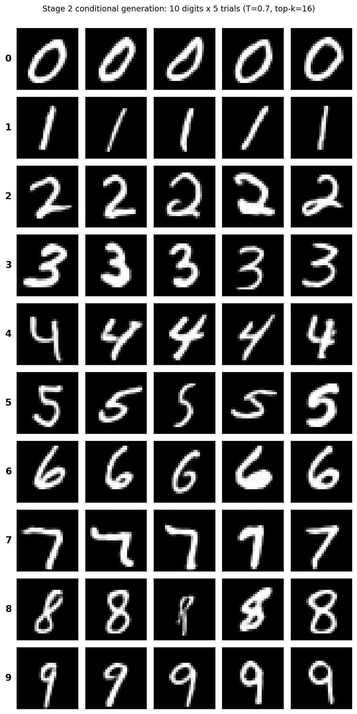

# VQ-VAE MNIST 复现

基于论文 *Neural Discrete Representation Learning*（van den Oord et al., NIPS 2017, [arXiv:1711.00937](https://arxiv.org/abs/1711.00937)）在 MNIST 上复现 VQ-VAE 的两阶段训练与条件生成流程：先用 VQ-VAE 把 28×28 的手写数字压缩成 7×7 的离散索引网格，再训练条件 Gated PixelCNN 先验 `p(z | label)`，实现输入数字 0-9、生成对应类别全新手写数字图像。



## 复现结果

| 阶段 | 指标 | 数值 |
|------|------|------|
| Stage 1（VQ-VAE，3.06M 参数） | 测试集重建 MSE | 0.0071 |
| | 活码数 | 64 / 64（无死码） |
| | Perplexity / 利用率 | 49.1 / 76.7% |
| Stage 2（Gated PixelCNN，8.17M 参数） | 验证集 loss（best） | 2.0958 nats/token @ 6K 步 |
| | bits/dim（仅先验） | 0.1890 |
| 生成 | CNN 辨识度（主指标） | 98%（100 张） |
| | NMC 辨识度（次指标） | 88%（真实 MNIST 在该指标下为 82%） |
| | 50 张人眼验收 | 50 / 50 全部可辨识 |

上图为 0-9 每类 5 次独立采样的验收网格（T=0.7, top-k=16）。原始 28×28 像素拼接的干净版本见 `assets/grid_50tests_clean.png`。

## 方法

### Stage 1：VQ-VAE 自编码器

```
28×28 图像 -> Encoder（两次 stride-2 下采样）-> 7×7×16 连续特征
           -> 向量量化（K=64 码本，查最近邻）-> 7×7 离散索引
           -> 查码本 -> Decoder（两次上采样）-> 28×28 重构
```

向量量化层做了三处工程修正，均针对复现中实测出现的问题：

1. **数据驱动初始化**：码本初值直接取首个 batch 的 encoder 输出样本。论文惯例的 `uniform(-1/K, 1/K)` 初始化与 encoder 输出量级相差约 1600 倍，导致几乎所有样本 argmin 到同一小撮码字、其余码字梯度恒为零而永久死亡。改用数据驱动初始化后，首步 vq_loss 从 611 降到 0.023，死码彻底消失。
2. **EMA 码本更新**（decay=0.99，Laplace 平滑），码本不参与梯度，损失只剩承诺项。
3. **死码重置**：每 200 步把 EMA 计数低于 1.0 的码字重置为当前 batch 的随机样本加噪声。

### Stage 2：条件 Gated PixelCNN 先验

```
7×7 索引网格 + 类别标签
  -> 索引 Embedding（64 -> 128）
  -> GatedMaskedConv2d × 12（首层 mask A，其余 mask B；垂直栈 + 水平栈 + 门控激活）
     每层独立注入类别条件（类别 -> 门控偏置）
  -> 输出投影 -> 每格 64 个码字的 logits
```

自回归采样 49 步得到索引网格，查码本后经 Stage 1 decoder 解码成图像。类别条件在每一层注入而非只在第一层注入一次，是修掉「让它画 2 却画出 Q」这类类别混淆的关键。因果性已用梯度依赖图验证：7×7 隐空间上无泄漏、无盲点。

两阶段流程图见 `assets/stage1_flowchart.png` 与 `assets/stage2_flowchart.png`，架构总览见 `assets/vqvae_architecture.png`。

## 快速开始

### 环境

- Python 3.10+
- PyTorch 2.x（CUDA 可选，CPU 也能跑，采样会慢一些）

```bash
pip install -r requirements.txt
```

MNIST 数据集在首次运行时自动下载到 `./data`。

### 训练

两个阶段各 20K 步，GPU（RTX 级别）上 Stage 1 约 34 分钟：

```bash
python stage1.py    # 训练 VQ-VAE，保存 vqvae_7x7_ema_v2.pth
python stage2.py    # 载入 Stage 1，训练先验，保存 prior_7x7_gated.pth
```

### 生成与评估

```bash
python generate.py         # 交互式：输入 0-9 出一张对应数字的图，q 退出
python run_50_tests.py     # 0-9 各 5 张共 50 张，拼网格图（验收用）
python assess_quality.py   # CNN + NMC 双指标辨识度评估（生成 100 张 + 混淆矩阵）
python sweep_sampling.py   # 温度 × top-k 网格搜索，确定采样默认值
```

首次运行评估类脚本时，若 `mnist_classifier.pth` 不存在，`classifier.py` 会自动训练一个评估用 CNN（1-2 分钟）。

### 采样超参

默认 `T=0.7 / top-k=16`，由 `sweep_sampling.py` 网格搜索确定。温度越低字形越规整、辨识度越高，代价是同类样本趋同。搜索目标不是最高准确率，而是辨识度达标前提下的最高温度，把多样性损失压到最小。

### 评估口径

- **CNN 准确率**（主指标）：用 99.11% 的 MNIST CNN 判断生成图是否是它该是的数字。
- **NMC 准确率**（次指标）：最近均值分类器，在真实 MNIST 测试集上也只有 82.0%，到 82% 即为指标饱和。
- 分类器只用于评分，不参与生成回路：本项目不使用拒绝采样，50/50 的验收由模型本身与采样超参达成。

## 目录结构

```
├── models.py            # 模型定义（VQ-VAE + Gated PixelCNN）+ 权重文件名常量
├── stage1.py            # Stage 1 训练（VQ-VAE，20K 步）
├── stage2.py            # Stage 2 训练（条件 Gated PixelCNN 先验，20K 步）
├── sampling.py          # 批量采样公共实现（温度 + top-k）
├── generate.py          # 交互式条件生成
├── run_50_tests.py      # 50 张批量生成验收
├── sweep_sampling.py    # 采样超参网格搜索
├── classifier.py        # 评估专用 MNIST CNN（只评分，不参与生成）
├── assess_quality.py    # CNN + NMC 双指标评估
└── assets/              # 结果图与流程图
```

## 复现过程中的实验发现

14×14 版的重建误差最低（0.0060），生成质量却最差。重建的上限由每个 token 携带的信息量决定，生成还取决于离散索引分布的规整程度，两者的瓶颈不同。该版本为整除 28 使用了 stride-3 下采样，卷积窗口之间没有重叠，笔画出现混叠，数字 3 的弧线被生成为 8；stride-2 窗口有重叠，不存在混叠。28 经两次 stride-2 下采样只能得到 7，隐空间由此定为 7×7。

码字维度 D 从 64 降到 16 后，同步数下重建误差持平，利用率上升。离散瓶颈的信息容量为 token 数 × log₂K，与 D 无关，D 只决定码字向量的表达空间。早期版本将 K 加到 128、D 加到 64，重建没有明显改善。

死码的成因是码本初始化与 encoder 输出的尺度失配。uniform(-1/K, 1/K) 初始化的取值范围约 ±0.016，encoder 输出约 ±25/维，相差三个数量级。初始阶段几乎所有样本的最近邻都落在同一小撮码字上，其余码字梯度恒为零，无法更新。14×14 版有 32 个码字从头到尾停在初始值附近。EMA 更新方式不受此影响：码字直接取 z_e 的滑动均值，不经过梯度。将码本改为用首个 batch 的 encoder 输出初始化后，首步 vq_loss 从 611 降到 0.023，死码问题消失。

活码数与 perplexity 利用率衡量的是不同的事：前者统计有没有码字死亡，后者衡量使用分布的均匀程度。MNIST 各笔画模式的出现频率天然不均，空白背景块远多于罕见转角，利用率达不到 100% 属正常现象，追求高利用率等同于要求真实数据服从均匀分布。

朴素掩码卷积的盲区大小与隐空间尺寸正相关，用梯度依赖图实测的结果：7×7 上盲点为 0，首层 7×7 大核的感受野已覆盖全图；28×28 上 783 个上文位置中 704 个是盲区。在 7×7 尺度上改用 Gated PixelCNN 的收益不在消除盲点，而在每层都能注入类别条件。早期实现只在第一层注入一次，类别信息在深层被稀释，出现画 2 生成 Q 的类别混淆。

## 致谢

- 原论文：van den Oord, A., Vinyals, O., & Kavukcuoglu, K. (2017). *Neural Discrete Representation Learning*. NIPS 2017. [arXiv:1711.00937](https://arxiv.org/abs/1711.00937)
- Gated PixelCNN：van den Oord, A., et al. (2016). *Conditional Image Generation with PixelCNN Decoders*. [arXiv:1606.05328](https://arxiv.org/abs/1606.05328)

## License

MIT License，见 [LICENSE](LICENSE)。
