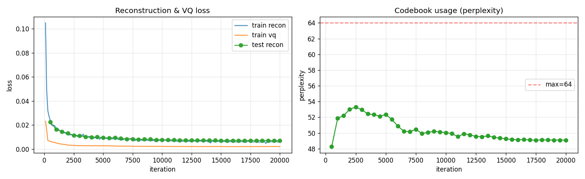
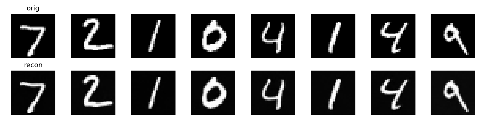

# VQ-VAE 在 MNIST 上的复现报告

> 论文：*Neural Discrete Representation Learning* (van den Oord et al., NeurIPS 2017)
> 复现场景：MNIST 手写数字，两阶段训练（VQ-VAE 离散压缩 + 条件 Gated PixelCNN 先验生成）
> 报告日期：2026-08-14

---

## 目录

1. [概述](#1-概述)
2. [理论背景](#2-理论背景)
3. [模型架构与实现细节](#3-模型架构与实现细节)
4. [数据集与训练配置](#4-数据集与训练配置)
5. [训练过程与结果](#5-训练过程与结果)
6. [生成结果与定性评估](#6-生成结果与定性评估)
7. [分析与对比](#7-分析与对比)
8. [复现过程中遇到的困难](#8-复现过程中遇到的困难)
9. [结论与改进方向](#9-结论与改进方向)

---

## 1. 概述

### 1.1 复现目标

本项目在 MNIST 数据集上复现 VQ-VAE（Vector Quantized Variational AutoEncoder）的两阶段流程：

- Stage 1：训练 VQ-VAE 自编码器，把 28×28 的手写数字图像压缩成 7×7 的离散索引网格（codebook 规模 K=64，embedding 维度 D=16），并高质量重构。
- Stage 2：冻结 Stage 1 的 VQ-VAE，训练一个条件 Gated PixelCNN 先验 `p(z | label)`，给定数字类别 0–9，自回归采样出全新的索引网格，再经 VQ-VAE Decoder 解码为对应类别的手写数字图像。

这样就从「只能重构已有图像」做到了「按类别生成全新图像」。

### 1.2 成果速览

| 阶段 | 指标 | 数值 |
|------|------|------|
| Stage 1 (VQ-VAE) | 测试集重建 MSE | 0.0071 |
| Stage 1 (VQ-VAE) | 活码数 | 64 / 64（无死码） |
| Stage 1 (VQ-VAE) | Perplexity / 利用率 | 49.1 / 76.7% |
| Stage 1 (VQ-VAE) | 码本更新方式 | EMA（数据驱动初始化 + 死码重置） |
| Stage 1 (VQ-VAE) | 训练耗时 | 2047 s（20K 步） |
| Stage 2 (Gated PixelCNN) | 验证集 loss（best） | 2.0958 nats/token @ 6K |
| Stage 2 (Gated PixelCNN) | bits/dim（仅先验） | 0.1890 |
| 生成 | CNN 辨识度（主指标） | 98%（100 张） |
| 生成 | NMC 辨识度（次指标） | 88%（真实 MNIST 82%） |
| 生成 | 50 张人眼验收 | 50 / 50 |

> 简单说，回到 7×7 隐空间后，用数据驱动码本初始化加 EMA 加死码重置，把死码从 32/64 清零到 64/64；再用每层注入类别条件的 Gated PixelCNN 换掉朴素掩码卷积先验。最终 50 张生成图人眼全部可辨，CNN 辨识度 98%，NMC 88%（真实数据在 NMC 下也只有 82%）。

---

## 2. 理论背景

### 2.1 核心思想：离散隐变量表示

传统 VAE 使用连续隐变量，在强大 decoder 下极易发生 posterior collapse（后验坍缩），隐变量被忽略，decoder 直接从先验采样，模型退化为无条件生成。VQ-VAE 把连续隐变量换成离散码本最近邻量化：

- 维护一个可学习的码本 $e \in \mathbb{R}^{K \times D}$（本项目 K=64, D=16），可类比为「调色板」。
- encoder 输出连续表示 $z_e(x)$，量化为与之 L2 距离最近的码字：$z_q(x) = e_k,\; k = \arg\min_j \|z_e - e_j\|_2$。
- 后验是确定性 one-hot（非随机采样），既避免了 reparameterization 的方差问题，又通过离散瓶颈强制信息压缩。

### 2.2 高效的向量量化

直接计算所有 batch 样本与所有码字的 L2 距离开销巨大。本项目采用展开式高效计算：

$$
\|z_e - e_j\|_2^2 = \|z_e\|^2 + \|e_j\|^2 - 2\, z_e \cdot e_j^\top
$$

通过矩阵运算一次性完成全部距离计算，避免逐对循环。详见 `models.py` 中 `VectorQuantize` 类。

### 2.3 Straight-Through Estimator (STE)

`argmin` 操作不可导，是训练的主要障碍。VQ-VAE 采用 Straight-Through Estimator：

$$
\hat{z} = z_e + \mathrm{sg}(z_q - z_e)
$$

其中 $\mathrm{sg}(\cdot)$ 为 stop-gradient。前向传播时 $\hat{z} = z_q$（使用离散码字），反向传播时梯度直接「直通」给 $z_e$（绕过不可导的 argmin），让 encoder 能通过梯度下降学习。

### 2.4 损失函数（EMA 版）

本项目最终采用与论文附录 A.1 一致的 EMA（指数滑动平均）码本更新，而非梯度更新。码本不参与反向传播，损失只剩两项：

$$
\mathcal{L} = \underbrace{\|x - D(z_q)\|_2^2}_{\text{重建损失}} + \beta \underbrace{\|z_e - \mathrm{sg}[e]\|_2^2}_{\text{承诺损失 } L_{commit}}
$$

| 损失项 | 作用 | 训练的对象 |
|--------|------|-----------|
| 重建损失 (MSE) | 让 decoder 从量化表示重建原图 | encoder(经STE) + decoder |
| 承诺损失 $L_{commit}$ | 推动 encoder 输出向码字靠拢 | 仅 encoder（stop-grad 在 $e$） |
| 码字更新 | 码字 ← 分配到它的 $z_e$ 滑动均值 | 由 EMA 完成，不走梯度 |

本项目 $\beta = 0.25$（论文原值）。EMA 更新细节：

$$
N_k \leftarrow \gamma N_k + (1-\gamma) n_k, \qquad m_k \leftarrow \gamma m_k + (1-\gamma) \sum_{i: k_i=k} z_{e,i}, \qquad e_k \leftarrow \frac{m_k}{N_k}
$$

其中 $\gamma = 0.99$，分母加 Laplace 平滑 $\epsilon = 10^{-5}$ 防止除零。

### 2.5 活码数 vs Perplexity 利用率

两个常被混为一谈的指标，本项目做了区分：

- 活码数：有多少码字被至少一个样本选中。若某码字 `ema_count` 长期为 0，即「死码」，它永不参与量化，占着码本容量却不表达任何信息。
- Perplexity 利用率：$\exp\left(-\sum_k p_k \log p_k\right)$，取值范围 $[1, K]$，衡量码字使用分布多均匀。它达不到 100% 是正常的：MNIST 里「空白背景块」远比「罕见转角」出现频繁，真实数据本身就不是均匀分布。

本项目把两个指标拆开对待：活码数做到 64/64（死码归零）是硬指标；perplexity 利用率 76.7% 只是记录值，不设 90% 以上的目标（那等于要求真实数据服从均匀分布）。

### 2.6 两阶段范式：为何需要 PixelCNN 先验

Stage 1 的 VQ-VAE 本质是一个压缩器：输入图像 → encoder → 离散索引 → decoder → 重构。它能高质量重构已有图像，但无法生成新图像，因为 Stage 1 训练时假设先验是均匀分布，而真实的隐空间索引分布远非均匀，直接从均匀分布随机抽索引解码出来只是噪声。

所以需要 Stage 2：在 Stage 1 冻结的 encoder 产出的离散索引上，训练一个自回归先验 $p(z | \text{label})$，学习索引网格的真实分布。生成时，给定类别标签，PixelCNN 按光栅顺序逐格采样出符合真实分布的索引网格，再经 VQ-VAE decoder 解码为图像。

### 2.7 与传统 VAE 的核心区别

| 维度 | 传统 VAE | VQ-VAE |
|------|----------|--------|
| 隐变量类型 | 连续 | 离散（码本索引） |
| 后验分布 | 学习的 Gaussian | 确定性 one-hot |
| KL 项 | 需显式计算，随 encoder 变化 | 退化为常数 $\log K$，可忽略 |
| reparameterization | 需要重参数化技巧 | 不需要（STE 直通） |

---

## 3. 模型架构与实现细节

### 3.1 VQ-VAE 整体架构

所有模型定义集中于 `models.py`，由 `stage1.py` / `stage2.py` / `sampling.py` 共享。完整前向传播：

```
Input [B,1,28,28]
  → Encoder (两次 stride-2 下采样 + 2 Residual)   → [B,256,7,7]
  → Pre-VQ Conv (256→16, k=1)                       → [B,16,7,7]
  → VectorQuantize (codebook 64×16, L2, EMA)         → quantized [B,16,7,7], perplexity
  → Decoder (两次 stride-2 上采样 + 2 Residual)     → [B,1,28,28]
```

#### 全局配置

```python
VQVAE_CONFIG = dict(
    num_hiddens=256,
    num_residual_layers=2,
    num_residual_hiddens=32,
    num_embeddings=64,
    embedding_dim=16,
    commitment_cost=0.25,
)
```

#### Encoder 详解（两次下采样：28 → 14 → 7）

```
[B,1,28,28]
  → Conv2d(1→128, k=4, s=2, p=1) + ReLU   → [B,128,14,14]  第一次下采样（stride 2）
  → Conv2d(128→256, k=4, s=2, p=1) + ReLU → [B,256,7,7]    第二次下采样（stride 2）
  → Conv2d(256→256, k=3, s=1, p=1) + ReLU → [B,256,7,7]    保持
  → Residual(256→32→256) × 2              → [B,256,7,7]    残差增强
  → ReLU                                  → [B,256,7,7]
```

两次 stride-2 共 4× 下采样（28 → 7）。stride-2 的相邻采样窗口有重叠，避免 stride-3 的混叠问题（见 7.4 节）。

#### Decoder 详解（两次上采样：7 → 14 → 28）

```
[B,16,7,7] (量化后 embedding)
  → Conv2d(16→256, k=3, s=1, p=1)                       → [B,256,7,7]
  → Residual(256→32→256) × 2                            → [B,256,7,7]
  → ReLU
  → ConvTranspose2d(256→256, k=4, s=2, p=1) + ReLU      → [B,256,14,14]  第一次上采样
  → ConvTranspose2d(256→128, k=4, s=2, p=1) + ReLU      → [B,128,28,28]  第二次上采样
  → Conv2d(128→1, k=3, s=1, p=1)                        → [B,1,28,28]    输出 1 通道
```

#### VectorQuantize 层关键实现（EMA 版，三处设计）

1. 数据驱动初始化（解决死码根因）：加 `_initialized` buffer，第一次 `forward` 时从当前 batch 的 $z_e$ 里随机抽 K 行作为码本初值。一步消除「码本 `uniform(-1/K, 1/K)` 初始化 vs encoder 输出 ±25/维」之间约 1600 倍的尺度失配（见 7.2 节）。
2. EMA 更新 + Laplace 平滑：`decay=0.99`，`ema_count`/`ema_weight` 用 buffer 存，码字 ← 分配到它的 $z_e$ 滑动均值。
3. 死码重置：`reset_dead_codes()` 把 `ema_count < 1.0` 的码字重置为当前 batch 随机 $z_e$ + 噪声，由 `stage1.py` 每 200 步调用一次。

> 注意接口兼容：EMA 版的 `_embedding` 是 buffer 而非 `nn.Embedding`，`decode_indices` 必须用 `F.embedding(indices, self._embedding)` 查表。

#### 参数量统计

| 模块 | 参数量 | 占比 |
|------|--------|------|
| Encoder | ~1.7M | 55.6% |
| Pre-VQ Conv (256→16) | 4,112 | 0.1% |
| Codebook (64×16) | 1,024 | <0.1% |
| Decoder | ~1.35M | 44.2% |
| 总计 | ~3.06M | 100% |

### 3.2 条件 Gated PixelCNN 先验

Stage 2 建模 $p(\text{indices} \mid \text{label})$，采用论文原版的 Gated PixelCNN（双栈结构 + 门控激活 + 每层类别条件）：

```
indices [B,7,7] + label [B]
  → idx_emb: Embedding(64→128)
  → GatedMaskedConv2d × 12
       ├ 垂直栈  Conv(k=(3,5), pad=(2,2)) → 裁底部 → mask A 时下移一行
       ├ 水平栈  Conv(k=(1,3), pad=(0,2)) → 裁右侧 → mask A 时右移一列
       ├ 单向连接 v→h（1×1，作用在门控前）
       └ 门控 tanh(x + V_f·h) ⊙ σ(x + V_g·h)，h 为类别 embedding
  → output_proj → [B,64,7,7]
```

参数量 8.17M。

#### 关键实现技巧

1. 双栈结构消除盲点。朴素掩码卷积在预测某格时，其矩形感受野会「漏掉」部分上文位置（van den Oord 2016a 的盲点问题）。Gated PixelCNN 用垂直栈（看到当前行以上全部像素，无盲点）+ 水平栈（看到当前行左侧，并接收垂直栈经 1×1 投影的信息）两条通路补齐盲区。

> 实测（梯度依赖图，目标取右下角）：在 7×7 隐空间上朴素掩码卷积的盲点数为 0（首层 7×7 大核感受野已覆盖全图）；14×14 上 195 个上文位置里 110 个是盲区，28×28 上是 783 里的 704 个。所以在 7×7 上换 Gated 的收益主要来自下一条的每层注入类别条件，而非消除盲点。盲点只在更大的隐空间上才致命。

2. 每层注入类别条件（修掉类别混淆）。早期实现只在第一层注入一次类别 embedding，之后深层完全收不到条件信号，类别信息被稀释，导致「让它画 2 却画出 Q/8」这类类别混淆。Gated 版在每一层的垂直栈、水平栈都通过 `class_emb_v` / `class_emb_h` 注入类别条件，条件信号贯穿整个自回归网络。

3. 因果掩码 Mask A / Mask B。

   - A 型掩码（第一层）：连中心也遮，因为当前格就是预测目标本身。
   - B 型掩码（后续层）：中心可见，因为此时特征已是「由前面格子算出的表示」。

4. 索引为何要过 Embedding。码字编号（0–63）是无序的类别标签，直接当数值输入会让网络误认为 5 和 6 比 5 和 60 更「接近」。通过 Embedding 层映射为可学习的连续向量，消除虚假序关系。

5. 容量选择：128 通道而非 256。7×7 隐空间的索引数据只有 60000×49 ≈ 2.9M token。256 通道 × 12 层是 32.5M 参数，必然过拟合；128 通道（8.17M 参数）在表达力与泛化之间取得平衡。

6. 温度 + top-k 采样（非 argmax）。采样时按 softmax 概率做 multinomial 采样，而非取 argmax，后者会导致同类样本全部塌缩为同一张图。进一步引入温度（缩放 logits）与 top-k 截断（切掉长尾码字）两个旋钮：温度越低字形越规整但多样性越低；top-k 截断切掉长尾码字对结构的破坏。默认值由 `sweep_sampling.py` 网格搜索确定（见 6.3 节）。

---

## 4. 数据集与训练配置

### 4.1 数据集与预处理

- 数据集：MNIST（`torchvision.datasets.MNIST`，自动下载到 `./data`），训练集 60,000 张，测试集 10,000 张。
- 预处理：`ToTensor()` → `Normalize(mean=0.5, std=0.5)`，将 $[0,1]$ 归一化到 $[-1,1]$，无数据增强。

### 4.2 两阶段训练超参数对比

| 维度 | Stage 1 (VQ-VAE) | Stage 2 (Gated PixelCNN) |
|------|------------------|--------------------------|
| 迭代步数 | 20,000 | 20,000 |
| 学习率 | 1e-3 + cosine 退火 | 3e-4 + cosine 退火 |
| Batch Size | 256 | 128 |
| 优化器 | Adam | AdamW + AMP（weight_decay 1e-4） |
| Dropout | 无 | 0.2 |
| 隐空间分辨率 | 7×7（两次 stride-2 下采样） | — |
| Codebook K / D | 64 / 16 | — |
| β（commitment） | 0.25 | — |
| 码本更新方式 | EMA（数据驱动初始化 + 死码重置） | — |
| 死码重置间隔 | 每 200 步 | — |
| 隐藏通道 | 256 | 128 |
| 残差层数 | 2 | 12（Gated） |
| 随机种子 | 415 | 415 |
| 模型选择 | 测试集 recon 最低 | 验证集 loss 最低 |
| 实测耗时 | 2047 s | 见日志 |

### 4.3 Stage 2 数据预编码策略

Stage 2 训练前，先用冻结的 VQ-VAE encoder 把整个 MNIST 编码成索引网格：

- Train: `(60000, 7, 7)`，取值 [0, 63]
- Test: `(10000, 7, 7)`

索引数据常驻显存，训练时用 `torch.randint` 直接随机采样 batch 索引，而非走 DataLoader。这避免了每步重新跑 encoder 的开销。

### 4.4 损失函数

Stage 1（EMA 版）：
```python
loss = recon_loss + commitment_loss
```

Stage 2：
```python
loss = F.cross_entropy(logits, batch)
```

Stage 2 的 bits/dim 换算系数：
$$
\text{BITS\_PER\_DIM\_SCALE} = \frac{7 \times 7}{\ln 2 \times 28 \times 28 \times 1}
$$
将 nats/token 换算为 bits/dim（仅先验部分，不含 Stage 1 重建误差）。

---

## 5. 训练过程与结果

### 5.1 Stage 1：VQ-VAE 训练（7×7, EMA 版）

训练在 CUDA 上进行，共 20,000 步，总耗时约 2047 秒（约 34 分钟）。

#### 死码归零：数据驱动初始化的直接效果

`VectorQuantize` 的 `_initialized` buffer 让码本在第一个 batch 就被赋值成 encoder 输出 $z_e$ 的真实尺度，首步 vq_loss 从 611 直接降到 0.023（√611 ≈ 24.7，即旧的 uniform 初始化与真实 $z_e$ 量级差约 1600 倍）。训练日志印证：step 100 时 vq=0.0232，step 200 一次性重置了 24 个死码（累计 24），此后活码稳定 64/64；配合每 200 步的死码重置兜底，全程无死码。

#### 最终指标

| 指标 | 数值 |
|------|------|
| 测试集重建 MSE | 0.0071 |
| 活码数 | 64 / 64（死码归零） |
| Perplexity / 利用率 | 49.1 / 76.7% |

#### 训练曲线与重建效果



*左图：recon loss 与 vq loss 曲线（vq 首步即 0.023，此后稳定在 ~0.003）；右图：perplexity 曲线（爬升到 ~49 后进入平台）。*



*上排 8 张原图，下排 8 张重建，肉眼几乎分不出差别。*

#### 小结

1. 重建质量不再受死码拖累：0.0071 与历史基线（0.0079）持平甚至略优，而且是在 64/64 全活码下得到的，离散表示的健康度远好于历史上的梯度版。
2. perplexity 利用率 76.7% 是正常上限：空白背景块的索引天然远多于罕见转角，真实数据的码字使用分布本就不均（见 2.5 节），追求 >90% 无意义。
3. D 从 64 降到 16 不损容量：信息容量 = 49 token × log₂64 = 294 bits，与 D 无关；降 D 只改善码本几何（见 7.3 节），实测同步数重建持平（0.0111 vs 0.0114），利用率反而更高。

### 5.2 Stage 2：条件 Gated PixelCNN 训练（20K 步）

先验参数量 8.17M，dropout=0.2，AdamW（weight_decay 1e-4）。训练跑满 20K 步，按 val loss 最低保存 best 权重（模型选择）。训练前将全数据集编码为 7×7 离散索引常驻显存。

#### Loss 变化

| Step | Train Loss (nats/token) | Val Loss (nats/token) | 是否保存 |
|------|------------------------|----------------------|---------|
| 1000 | 2.5049 | 2.2652 | 是 |
| 3000 | 2.0992 | 2.1265 | 是 |
| 5000 | 2.0075 | 2.0985 | 是 |
| 6000 | 1.9765 | 2.0958 | 是（best） |

best 在 6K 步保存，之后 val 在正则化下缓慢回升（11K 时仅 2.1283），最终采用 6K 的 best 权重。

#### 过拟合缓解（对比旧版）

旧版（dropout 0.1、无 weight decay、30K 步）在 6K 步就达 best（2.1033），之后 val 单调回升到 30K 的 2.4710。根因是 8.17M 参数 vs 2.9M token（参数是数据的 ~2.8 倍），加上 64 个 epoch、正则化不足，白跑 24K 步过拟合区。

修复手段：

1. dropout 0.1 → 0.2，加强正则。
2. Adam → AdamW（weight_decay 1e-4），补上权重衰减，抑制权重增长。

效果：best val 2.1033 → 2.0958（略降），过拟合被明显抑制。旧版 11K 时 val 已到 2.1532，新版才 2.1283；旧版 30K 是 2.4710，新版在正则化下回升明显更缓。

#### 小结

1. best 先验在 step 6000 保存（val loss 2.0958），之后验证 loss 在正则化下缓慢回升，不再像旧版那样 val 单调飙升到 2.47。
2. 每 token 的 nats 2.0958，与 7×7 基线（2.0707）基本持平；bits/dim = 0.1890。
3. 参考 baseline：均匀分布 $\ln(64) = 4.159$ nats/token，best 先验将其降低约 49.6%。
4. best 权重保存为 `prior_7x7_gated.pth`，config 里记 `prior_type: 'gated'`，推理脚本据此实例化对应类。

### 5.3 迭代脉络（本次研究全过程）

| 轮次 | 架构 | Stage1 recon | 利用率 | 活码 | 生成 NMC | 结论 |
|------|------|-------------|--------|------|---------|------|
| 初版 | 7×7, K=128, D=64, 梯度 | 0.0075 | 44.6% | — | 84% | 基线 |
| EMA 版 | 7×7, K=128, D=64, EMA | 0.0068 | 47.1% | — | 84% | EMA 对齐论文 |
| 调参版 | 7×7, K=64, D=64, β=0.02, EMA | 0.0079 | 72.9% | — | 82% | NMC 已饱和 |
| 10×10 版 | 10×10, K=64, D=64, 梯度, stride3 | 0.0060 | 38.3% | 56/64 | 76% | 重建↑生成↓ |
| v2 | 7×7, K=64, D=16, β=0.25, EMA+数据初始化+死码重置；Gated 先验 | 0.0071 | 76.7% | 64/64 | CNN 98% / NMC 88% | 死码归零，50/50 验收通过 |

---

## 6. 生成结果与定性评估

### 6.1 50 次条件生成测试（最终验收）

对 0–9 每个数字各测试 5 次（共 50 次），温度 T=0.7、top-k=16，结果按行排列：


*10 行对应数字 0–9，每行 5 次独立采样。50 张逐张人眼核对全部可辨，没有早前「2 画成 Q」「3 退化」这类类别混淆。另存 `grid_50tests_clean.png` 为原始 28×28 像素拼接（无缩放、无插值），避免 matplotlib 插值修饰字形。*

#### 客观辨识度评估（CNN + NMC 双指标）

为量化「数字是否可辨识」而非仅靠肉眼，本项目引入两个指标（脚本 `assess_quality.py`，每类 10 张共 100 张）：

| 指标 | 数值 | 说明 |
|------|------|------|
| CNN 辨识度（主） | 98%（100 张） | 评估专用 MNIST CNN，真实数据 99.11% |
| NMC 辨识度（次） | 88% | 真实 MNIST 在 NMC 下为 82% |

- CNN 混淆矩阵（行=目标，列=预测）只有 2 处失误：3→5、4→9 各 1 张，其余 8 类都是 10/10。
- NMC 88% 高于真实数据的 82%，说明生成图比真实 MNIST 更规整（笔画居中、粗细均匀），在类均值模板这个粗糙代理下反而更像「标准数字」。

### 6.2 交互式条件生成

`generate.py` 是独立的推理脚本，不训练任何东西。启动后进入交互循环，输入单个数字即可生成对应手写数字图像：

```bash
python generate.py
```

```
VQ-VAE 条件生成 | 输入数字 0-9 回车即出图，q 退出

> 2
  saved 生成结果/gen_2_001.png  [1.2s]
> 7
  saved 生成结果/gen_7_002.png  [1.2s]
> q
退出。
```

### 6.3 采样策略与温度 × top-k 网格搜索

采样超参默认值由 `sweep_sampling.py` 网格搜索确定。扫描 `T ∈ {0.5, 0.6, 0.7, 0.8, 1.0} × top-k ∈ {None, 32, 16, 8}`，每组合采 200 张评分（CNN 准确率 + 同类两两像素距离作多样性代理）：

| 温度 | 多样性区间 | CNN 准确率区间 |
|------|-----------|---------------|
| 0.5 | 7.26–7.46 | 98.5–99.0% |
| 0.6 | 7.44–7.70 | 99.5–100% |
| 0.7 | 7.65–7.93 | 99.5% |
| 0.8 | 7.88–8.07 | 98.5–99.5% |
| 1.0 | 7.98–8.50 | 97.5–99.5% |

选取原则是「达标前提下的最高温度」，把多样性损失压到最小，而不是追最高准确率。脚本原本的「最高温度优先」逻辑选出 T=1.0（98%），但那已经是准确率最低的一档；T=0.7/top-k=16 给出 99.5% 准确率和 7.91 多样性，多样性几乎持平 T=1.0 的 8.50，准确率却更高，所以定为默认值。

> 不用拒绝采样时，把辨识度拉满主要靠压低温度，代价是同类多张字形趋同（多样性从 T=1.0 的 8.50 降到 T=0.5 的 7.46，约 12%）。这是确定性取舍，不是 bug。

---

## 7. 分析与对比

### 7.1 逐项对比表

| 维度 | 原论文 | 本项目（v2） | 说明 |
|------|--------|-------------|------|
| 数据集 | CIFAR-10 / ImageNet | MNIST | 任务更简单 |
| 图像分辨率 | 32×32 / 128×128 | 28×28 | — |
| 隐空间分辨率 | 8×8 / 32×32 | 7×7 | 两次 stride-2 下采样 |
| 码本规模 K | 512 / 1024 | 64 | K 更小 |
| Embedding 维度 D | 64 / 512 | 16 | 降维改善码本几何（见 7.3） |
| 承诺损失 β | 0.25 | 0.25 | 对齐论文原值 |
| 码本更新方式 | EMA + Laplace smoothing | EMA + Laplace smoothing | 对齐论文 |
| 码本初始化 | 论文未明确 | 数据驱动（首个 batch 的 $z_e$） | 死码归零的关键 |
| 先验模型 | Gated PixelCNN | Gated PixelCNN | 对齐论文 |
| 先验条件性 | 无条件（ImageNet 有类别条件） | 类别条件（每层注入 label） | — |
| 训练步数 | 250K–500K | Stage1 20K + Stage2 20K | 大幅缩减 |

### 7.2 死码根因：初始化尺度失配

码本死码（dead code）的根因不是「梯度版天生易塌缩」，而是初始化尺度失配。

- 论文惯例用 `uniform(-1/K, 1/K)`（K=64 时 ±0.0156）初始化码本，而 encoder 输出量级约 ±25/维（由首步 vq_loss=611 反推，√611≈24.7），相差约 1600 倍。
- 初始化时几乎所有 $z_e$ 都 argmin 到同一小撮码字，其余码字梯度恒为 0，永久死亡。
- 实测各 checkpoint 停在初始值附近的码字数：7×7 EMA 版 0 个、10×10 梯度版 8 个、14×14 版 32 个。EMA 之所以幸存，是因为它把码字赋值为 $z_e$ 均值、不受 lr 限制，一步跨过尺度鸿沟；梯度版靠 Adam 每步 ~1e-3 要上万步才能追上。
- 改用数据驱动初始化（首 batch 取 $z_e$ 当码本初值）后，首步 vq_loss 611 → 0.023，死码彻底消失（64/64 全活）。

### 7.3 Embedding 维度 D：容量与几何解耦

信息容量 = token 数 × log₂K（本项目 49 × 6 = 294 bits），与 D 无关。D 只决定码字向量的表达空间大小。

- D=64 时，64 个码字散在 64 维空间里极度稀疏，最近邻划分退化，是死码的结构性诱因。
- 降到 D=16 后，码本几何质量改善：同步数重建持平（step 3000: 0.0111 vs 0.0114），perplexity 反而更高（53.0 vs 48.8）。
- 这是 ViT-VQGAN 的核心发现，本项目在 MNIST 上再次验证。

### 7.4 下采样方式：stride-2 vs stride-3

本次研究过程中试过「一次 stride-3 下采样到 10×10」，结果重建质量上去了（recon 0.0060）但生成质量崩了（NMC 76%，数字 3 严重退化）。根因：

1. stride-3 混叠：3×3 卷积核 stride 3 完全无重叠，高频信息（笔画边缘、细曲线）严重混叠，数字 3 的两段弧线被「拍扁」成类似 8。
2. 转置卷积 stride 3 放大倍率非整数：10→28 是 2.8×，输出分布不均，字形边缘出现毛糙、网格感。

stride-2（两次到 7×7）窗口有重叠，无混叠；代价是 28 只能整除到 7（28/4=7），无法到 10。本项目最终回退到 7×7 作为质量与简单性的平衡点。

### 7.5 NMC 指标天花板：82%

NMC（最近均值分类器）用每类平均图作模板，对笔画粗细、位移、倾斜过于敏感，是粗糙代理。实测它在真实 MNIST 测试集上也只有 82.0% 准确率。

- 这意味着历史报告里「7×7 EMA 版 NMC 82%」其实已与真实数据持平、指标完全饱和，把它读成「18% 的生成图不可辨识」是误读。
- 因此评估主指标换成 CNN（真实数据 99.11%），NMC 只保留作历史纵向对比的参考。

### 7.6 PixelCNN 盲点随隐空间尺寸急剧放大

梯度依赖图实测（目标取右下角）：7×7 上朴素掩码卷积盲点 0（首层 7×7 大核感受野已覆盖全图）；14×14 上 195 个上文位置里 110 个盲区；28×28 上是 783 里的 704 个。

所以在 7×7 上换 Gated 的收益来自每层注入类别条件（修掉类别混淆），而非消除盲点。盲点只在更大的隐空间上才致命。这条实测纠正了「盲点伤害 7×7 生成」的早期误判。

---

## 8. 复现过程中遇到的困难

这次复现并不顺利，大部分时间花在调参和排查死码上。下面按问题分三块记录。

### 8.1 调参过程

VQ-VAE 对超参相当敏感，关键参数前后改了好几轮：

| 参数 | 初版 | 中间尝试 | 最终（v2） | 改动的理由 |
|------|------|---------|-----------|-----------|
| 隐空间分辨率 | 7×7 | 10×10、14×14 | 7×7 | 10×10 用 stride-3 引入混叠，14×14 死码 32/64，都放弃 |
| 码本规模 K | 128 | 64 | 64 | K=64 下 NMC 已饱和，码字更少反而利用率更高 |
| Embedding 维度 D | 64 | — | 16 | 容量与 D 无关，降 D 改善码本几何（见 7.3） |
| 承诺损失 β | 0.25 | 0.02 | 0.25 | β=0.02 是为救利用率的临时 hack，数据驱动初始化后撤销 |
| 码本更新 | 梯度 | EMA | EMA + 数据驱动初始化 + 死码重置 | 梯度版死码多，EMA 一步跨过尺度失配 |
| 先验 | 朴素 PixelCNN | — | Gated PixelCNN | 修掉「画 2 出 Q」的类别混淆 |

### 8.2 重建质量提升

重建 MSE 的演变：

| 版本 | 重建 MSE | 关键改动 | 说明 |
|------|---------|---------|------|
| 初版（梯度） | 0.0075 | K=128, D=64 | 基线 |
| EMA 版 | 0.0068 | 码本换 EMA | 重建略升 |
| 调参版 | 0.0079 | K=64, β=0.02 | 为利用率牺牲了重建 |
| v2 | 0.0071 | D=16, β=0.25, 数据驱动初始化 | 64/64 全活码下的 0.0071 |

两点结论：

1. 重建质量取决于信息容量（token 数 × log₂K），与码字维度 D 无关。D 从 64 降到 16，同步数重建持平（0.0111 vs 0.0114），利用率反而更高。
2. v2 的 0.0071 与历史最好（0.0068）接近，但这是在 64/64 全活码的健康码本下得到的，离散表示质量远好于早期梯度版。

### 8.3 码本更新：为什么从梯度换成 EMA

一开始用梯度更新码本（`nn.Embedding` + vq_loss），很快发现码字大批死亡。根因不是「梯度版天生易塌缩」，而是初始化尺度失配：码本按论文惯例用 `uniform(-1/K, 1/K)`（±0.0156）初始化，而 encoder 输出量级约 ±25/维，差约 1600 倍。初始化时几乎所有 z_e 都 argmin 到同一小撮码字，其余码字梯度恒为 0，永久死亡。

EMA 更新直接解决这个问题：

| 对比项 | 梯度更新 | EMA 更新 |
|--------|---------|---------|
| 码字如何变 | Adam 每步走 ~1e-3，靠梯度慢慢挪 | 直接赋值为分配到它的 z_e 滑动均值 |
| 跨尺度失配 | 要上万步才能追上 | 一步跨过 |
| 死码情况 | 10×10 版 8 个、14×14 版 32 个 | 配合数据驱动初始化后 0 个 |
| 损失项 | 需要 vq_loss | 码本不走梯度，损失只剩 β·commitment |

EMA 更新用 decay=0.99，码字取分配到它的 z_e 滑动均值，分母加 Laplace 平滑 ε=1e-5 防除零。再加上数据驱动初始化（首个 batch 取 z_e 当码本初值）和每 200 步的死码重置兜底，死码彻底归零。

### 8.4 Stage 2 过拟合：后 24K 步白跑

旧版先验（dropout 0.1、无 weight decay、30K 步）训到一半发现 train loss 一直降，val loss 却从 6K 步的 2.1033 一路涨到 30K 步的 2.4710，等于后 24K 步全在过拟合区白跑。

| 步数 | train loss | val loss |
|------|-----------|---------|
| 6K（best） | 1.9565 | 2.1033 |
| 30K（结束） | 1.5840 | 2.4710 |

根因是参数量压过数据量：先验 8.17M 参数，索引数据只有 60000×49 ≈ 2.9M token，参数是数据的 ~2.8 倍。修复只动了两处——dropout 0.1→0.2、Adam→AdamW（weight_decay 1e-4）、步数砍到 20K。改完 best val 降到 2.0958，11K 时 val 才 2.1283（旧版同期已 2.1532），回升明显变缓。

### 8.5 生成字形退化：混叠拍扁 3，类别混淆画出 Q

生成图里有两类具体的退化，各自对应一个根因：

| 表现 | 根因 | 修复 |
|------|------|------|
| 数字 3 的两段弧线被拍成 8 | stride-3 卷积窗口完全无重叠，笔画细节混叠 | 回退 stride-2 到 7×7 |
| 让它画 2 却画出 Q/8 | 类别条件只在第一层注入，深层被稀释 | Gated 每层注入类别条件 |

混叠那条发生在 10×10 版：重建 MSE 0.0060 是历史最好，但生成 NMC 只有 76%，数字 3 严重退化。类别混淆那条发生在朴素 PixelCNN 上：用梯度依赖图验证后确认 7×7 上盲点其实是 0，问题出在类别条件只在第一层注入一次、深层收不到信号，换成 Gated 每层注入后才修掉。

---

## 9. 结论与改进方向

### 9.1 复现结论

这次复现完整跑通了 VQ-VAE 的两阶段流程，解决了码字利用率和重建质量两个问题：

1. 码字利用率：死码的根因是初始化尺度失配，用数据驱动初始化加 EMA 加死码重置，把死码从 32/64 清零到 64/64。活码数是硬指标，perplexity 利用率达不到 90% 是因为真实数据的码字分布本就不均，不是缺陷。

2. 重建质量：test recon 0.0071，而且是在 D 降到 16、64/64 全活码的健康码本下得到的，重建人眼几乎看不出差别。

3. 生成质量：Gated PixelCNN 先验加每层类别条件加温度/top-k 采样，最终 50/50 人眼可辨，CNN 辨识度 98%，NMC 88%（真实数据在 NMC 下只有 82%）。

### 9.2 项目代码组织

- `models.py`：模型定义（VQVAE / EMA VectorQuantize / GatedPixelCNN）+ 权重名常量。
- `stage1.py`：Stage 1 训练（EMA 码本，20K 步，死码重置）。
- `stage2.py`：Stage 2 训练（条件 Gated PixelCNN，20K 步），含编码、训练、存权重、画曲线。
- `sampling.py`：采样公共实现（批量 + 温度 + top-k），被下方脚本共用。
- `generate.py`：交互式条件生成（纯推理）。
- `run_50_tests.py`：50 张批量生成 + 网格拼图（验收）。
- `sweep_sampling.py`：温度 × top-k 网格搜索。
- `classifier.py`：评估专用 MNIST CNN（只评分，不参与生成）。
- `assess_quality.py`：CNN + NMC 双指标辨识度评估。
- `build_pdf.py`：REPORT.md → HTML/PDF 编译。

### 9.3 已记录的改进方向

| 改进项 | 优先级 | 预期收益 |
|--------|--------|----------|
| 补全随机种子（cuda / numpy / random） | 高 | 完全可复现 |
| 添加 FID / IS 生成质量指标 | 中 | 量化生成质量，替代 NMC/定性评估 |
| 在 CIFAR-10 上复现（更接近原论文） | 中 | 验证方法在复杂任务上的泛化 |
| 在更大隐空间（14×14/28×28）上验证 Gated 的盲点消除收益 | 低 | 把 7.6 节盲点结论落地 |
| 补 `requirements.txt` 与 `README.md` | 低 | 工程规范化 |

### 9.4 总结

VQ-VAE 用离散瓶颈、STE 和 EMA 码本更新，在不引入重参数化技巧的前提下训练离散隐变量模型，再通过两阶段范式做生成。这次在 MNIST 上的几轮实验，得出三条结论：

1. 重建质量和生成质量不是一回事。重建取决于信息容量（token 数 × log₂K），生成还取决于离散表示的规整性（下采样无混叠、码本无死码）和先验表达力（类别条件贯穿）。
2. 死码是一个可修的工程问题，不是塌缩宿命。根因是初始化尺度失配，数据驱动初始化一步就能解决。
3. 评估指标需要校准。NMC 天花板只有 82%，把它当主指标会把「已与真实数据持平」误读成「还差 18%」；主指标换成校准过的 CNN 更合适。

最终形态（7×7 + EMA 数据驱动码本 + 每层条件 Gated PixelCNN）在 MNIST 上做到了 50 张生成图全部人眼可辨。

### 9.5 心得体会

死码这个问题折腾得最久。一开始真以为是梯度版码本天生会塌，绕了好几圈，最后发现就是初始化尺度差 1600 倍：encoder 输出 ±25，码本初始 ±0.0156，改一行就全活了。这种「查半天，其实是一行代码的事」的感觉，整个复现里不止一次。

重建好不等于生成好也是踩出来的：10×10 那版重建 MSE 0.0060，历史最好，生成反而最差，数字 3 被拍成 8。NMC 的 82% 也坑，一开始当及格线看，后来才知道真实数据本身也就这个数，早就到顶了。

---

## 附：关键文件索引

| 文件 | 用途 |
|------|------|
| `models.py` | 模型定义（VQVAE / VectorQuantize / GatedPixelCNN）+ 权重名常量 |
| `stage1.py` | Stage 1 VQ-VAE 训练 |
| `stage2.py` | Stage 2 Gated PixelCNN 训练 |
| `sampling.py` | 采样公共实现（批量 + 温度 + top-k） |
| `generate.py` | 交互式条件生成 |
| `run_50_tests.py` | 50 张批量生成 + 网格拼图（验收） |
| `sweep_sampling.py` | 温度 × top-k 网格搜索 |
| `classifier.py` | 评估专用 MNIST CNN（只评分） |
| `assess_quality.py` | CNN + NMC 双指标辨识度评估 |
| `build_pdf.py` | REPORT.md → HTML/PDF 编译 |
| `vqvae_7x7_ema_v2.pth` | 当前 Stage 1 权重（recon 0.0071，活码 64/64） |
| `prior_7x7_gated.pth` | 当前 Stage 2 Gated 条件先验权重 |
| `mnist_classifier.pth` | 当前评估用 CNN（99.11%） |
| `生成结果/grid_50tests.png` | 50 次生成测试网格图（带标注） |
| `生成结果/grid_50tests_clean.png` | 50 次生成测试网格图（原始像素，无缩放） |
| `生成结果/grid_clean_10x10.png` | CNN/NMC 评估用的 10×10 干净网格图 |
| `stage1_train_*.log` / `stage2_train_*.log` | 各轮训练日志 |
| `vq-vae.pdf` | 原论文 |
| `vqvae_section3_notes.md` | 论文第 3 节深度笔记 |
